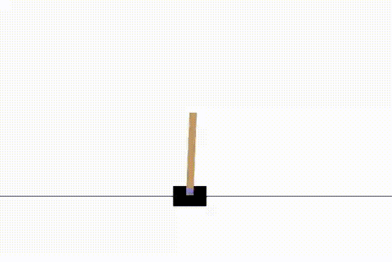
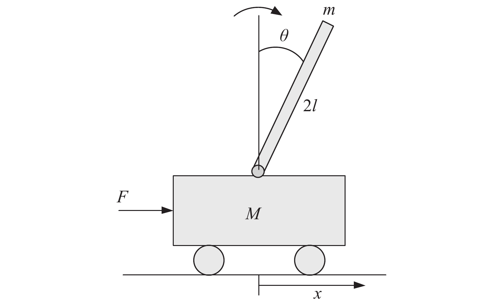
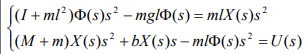
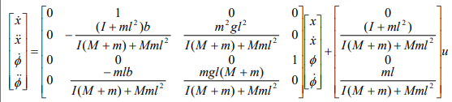
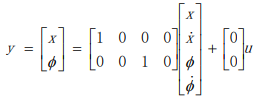
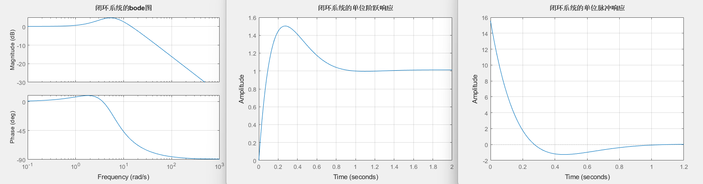

<h1>Single-Inverted-Pendulum-学习合集</h1>

<i>1. 强化学习Q-learning算法解决Gym的Cartpole-v1模型</i>

<i>2. 双环PID控制一阶倒立摆Mujoco仿真</i>

<i>具体代码及README文件见各项目文件夹</i>

---

# 1️⃣ Q-Learning

使用 Q-learning 强化学习训练 OpenAI Gym 中的经典平衡控制任务 **CartPole-v1**。

**780 Episode**后Cartpole表现：

  

## 🟠环境简介

CartPole 是一个一阶倒立摆环境，其任务是通过移动小车来保持杆子竖直。

将该游戏的复杂情景在进行强化学习时抽解为三个变量：

**状态（State）**、**动作（Action）** 和 **奖励（Reward）**。

---

### 状态（State）

每个环境状态由以下 **4 个连续变量** 组成，表示当前物理系统的信息：

| 特征名称             | 含义                         | 数值范围           | 离散方式     |
|:--------------------:|:----------------------------:|:------------------:|:------------:|
| 小车位置 `cart_pos`  | 小车相对于中心的水平位置     | [-2.4, 2.4]        | 分为 4 段     |
| 小车速度 `cart_v`    | 小车的水平移动速度           | [-3.0, 3.0]        | 分为 4 段     |
| 杆子角度 `pole_angle`| 杆子与竖直方向的偏移角度     | [-0.5, 0.5]（rad）| 分为 4 段     |
| 杆子角速度 `pole_v`  | 杆子旋转的角速度             | [-2.0, 2.0]        | 分为 4 段     |

对上述变量进行离散化，最终共有：

> 4 * 4 * 4 * 4 = 256 种可能状态。

---

### 动作（Action）

动作空间中，每个时间步只能执行以下两种动作之一：

| 动作编号 | 动作含义     |
|:--------:|:------------:|
| `0`      | 向左施加力   |
| `1`      | 向右施加力   |

算法会根据当前状态的 Q 值表选择一个动作来与游戏环境交互。

---

### 奖励（Reward）

环境的奖励机制如下：

- 每撑过一个时间步（不失败）奖励 `+1`
- 若提前失败（杆子倾倒或小车出界），立即给予 `-200` 的惩罚奖励

## 🟠Q-Learning公式（更新Q表）

Q-learning 算法通过以下公式不断Q表：更新状态-动作函数 Q(s, a)：

$$
Q(s_t, a_t) \leftarrow (1 - \alpha) \cdot Q(s_t, a_t) + \alpha \cdot \left[ r_t + \gamma \cdot \max_{a'} Q(s_{t+1}, a') \right]
$$

### 符号含义说明

| 符号                    | 含义说明                                           |
|:-----------------------:|:--------------------------------------------------:|
| `Q(s, a)`               | 当前状态 `s` 下，执行动作 `a` 的 Q 值              |
| `α` (alpha)             | 学习率（learning rate），控制新旧信息的更新比例   |
| `r`                     | 当前步获得的奖励（reward）                         |
| `γ` (gamma)             | 折扣因子（discount factor），衡量未来奖励的重要性  |
| `max_a' Q(s', a')`      | 下一个状态 `s'` 下所有可能动作中的最大 Q 值        |

此更新规则将当前的 Q 表，通过不断尝试和更新，最终学得最优策略。

## 🟠控制策略：ε-贪婪

为平衡探索与利用，采用 ε-贪婪策略：

- **ε** 随着训练进程逐步衰减:

$$
ε = 0.5 × (0.99^n), (n为Episode)
$$

- 在每次决策中，以`1-ε`的概率选择当前 Q 表中最优动作，以 ε 的概率随机选择动作。

## 🟠学习过程、成功条件与退出机制

- **学习率**：`α = 0.2`
- **折扣因子**：`γ = 0.99`
- 每局游戏最多 `200` 步
- 总训练局数为 `1000` 局
- 当连续 100 局游戏的平均得分达到或超过 `195` 时，训练提前终止，并输出成功提示信息

---

# 2️⃣ Double-loop PID simulating with Mujoco

使用双环（角度+位置）PID 控制器与DeepMind Control Suite的Mujoco倒立摆模型实现仿真

调整双闭环PID控制器参数后Cartpole表现：

  

## 🟠数学建模：一阶倒立摆动力学模型

以标准的 **一阶倒立摆（Single Inverted Pendulum on a Cart）** 为研究对象，下图为**参考一阶倒立摆**模型：

  

### 系统参数

| 符号     | 含义             | 单位        | dm_control-xml模型参数 |
|:----------:|:------------------:|:-------------:|:---------------------:|
| `L`      | 摆杆长度         | 米 (m)       | 0.6                 |
| `m`      | 摆杆质量         | 千克 (kg)    | 4.2                 |
| `M`      | 小车质量         | 千克 (kg)    | 8                 |
| `g`      | 重力加速度       | 米/秒² (m/s²)| -9.81                |
| `b`      | 摩擦阻尼系数     | 牛·秒/米 (N·s/m) | 0.1              |

### 系统状态变量

| 符号            | 含义                     | 单位           |
|:-----------------:|:--------------------------:|:----------------:|
| `x`             | 小车位置                 | 米 (m)         |
| `𝑥̇` (x_dot)     | 小车速度                 | 米/秒 (m/s)    |
| `θ` (theta)     | 摆杆偏离竖直的角度       | 弧度 (rad)     |
| `θ̇` (theta_dot) | 摆杆角速度               | 弧度/秒 (rad/s)|

其动力学方程可由拉格朗日方程推导：

**水平方向**运动方程：

$$
F = (M + m)·ẍ + b·ẋ + m·l·θ̈·cos(θ) − m·l·(θ̇)²·sin(θ)
$$

**竖直方向**运动方程：

$$
P - m·g = -m·l·θ̈·sin(θ) - m·l·(θ̇)²·cos(θ)
$$

对两个运动方程进行近似处理、线性化处理，cos(θ)=-1，sin(θ)=-Φ；再进行拉普拉斯变换，得到：

  

由拉普拉斯变换解出两个方向的传递函数，控制系统的状态空间方程可写成如下形式：

$$
ẋ=AX+Bu
$$

$$
Y=CX+Du
$$

> u表示系统控制输入向量，x表示系统状态变量，y表示系统的输出向量，A表示系统的状态矩阵，B表示系统控制输入矩阵，C表示系统输出观测矩阵，D表示系统输入输出矩阵。

根据运动方程组和拉普拉斯变换对ẍ和Φ̈ 求解可得解如下：

  

  

## 🟠PID控制器设计

PID控制器的参数`Kp,Ki,Kd`通过经验数据或试凑法很难进行调整得到合适的控制器，我们在得到传递函数之后，可以通过matlab的`pidtune`函数来对参数进行一个简单的设计。

例如我们根据dm_control的cartpole-xml模型的物理参数可以得到其角度的传递函数：

$$
P_Φ = Φ_s / U_s = (0.276·s²)/(s⁴ + 0.11·s³ − 33.06·s² − 2.694·s)
$$

对其应用`pidtune`: [Kpid, ~, ~] = pidtune(P_bai, 'PID')，我们可以得到：

- K_p= 449.4918
- K_i= 801.4594
- K_d= 56.3668

通过构建仿真闭环系统的bode图、单位阶跃响应、单位脉冲响应，我们可以看到在一定时间后，输出已经收敛：

  

## 🟠dm_control Mujoco仿真设计

我们应用Deepmind构建的Cartpole模型来对倒立摆进行仿真，具体xml模型文件请见文件夹，其中

  

    🎯 示例
  

